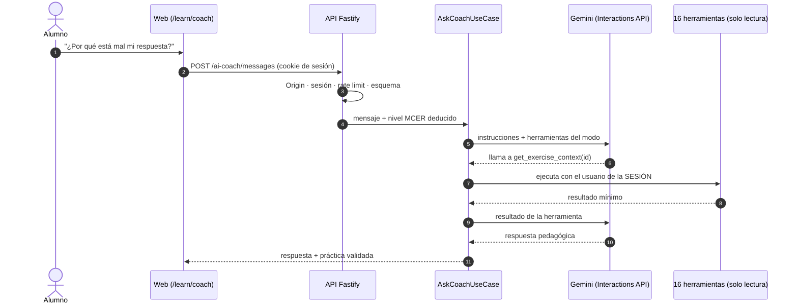
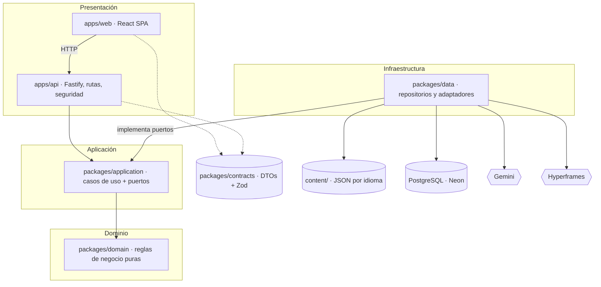
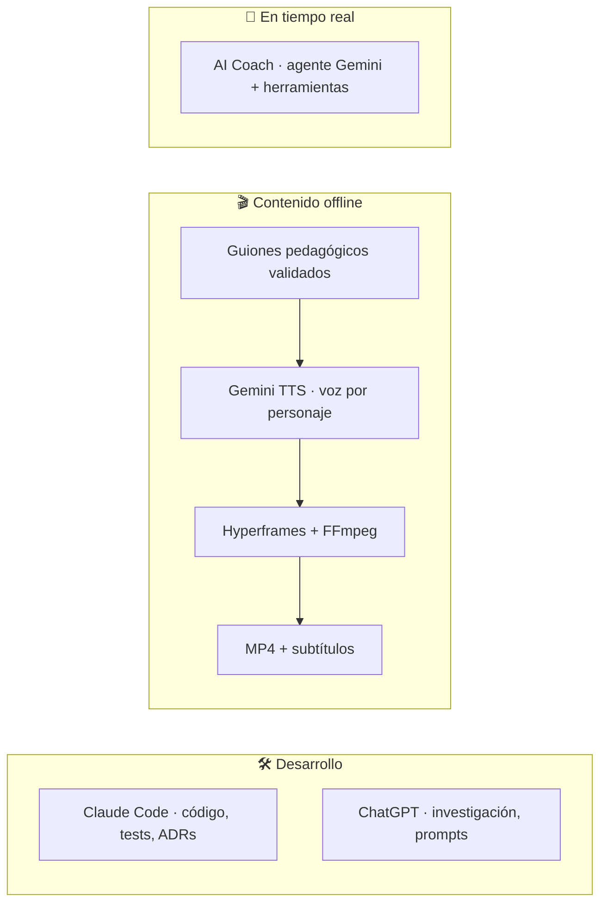
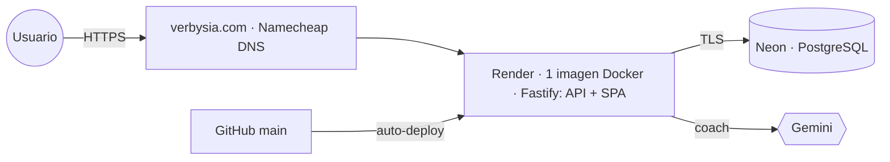
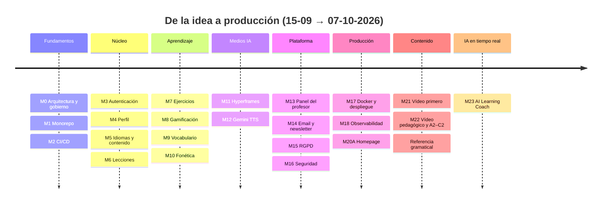

<div align="center">


# Verbysia · TFM-BIC

### Aprende idiomas con vídeos pedagógicos, audio nativo, ejercicios, gamificación y un coach de IA

**Trabajo de Fin de Máster — Máster en Desarrollo de Software con IA (BIC)**

[](https://www.verbysia.com)


<br/>


[Demo](https://www.verbysia.com) ·
[Funcionalidades](#-funcionalidades) ·
[AI Coach](#-ai-learning-coach) ·
[Arquitectura](#️-arquitectura) ·
[Puesta en marcha](#️-puesta-en-marcha-local) ·
[Documentación](#-documentación)

</div>

---

## 📑 Índice

- [¿Qué es?](#-qué-es)
- [Problema y solución](#-problema-y-solución)
- [Funcionalidades](#-funcionalidades)
- [AI Learning Coach](#-ai-learning-coach)
- [Contenido disponible](#-contenido-disponible)
- [Stack tecnológico](#-stack-tecnológico)
- [Arquitectura](#️-arquitectura)
- [IA en el proyecto](#-ia-en-el-proyecto)
- [Calidad y testing](#-calidad-y-testing)
- [Seguridad y privacidad](#-seguridad-y-privacidad)
- [Despliegue](#-despliegue)
- [Puesta en marcha local](#️-puesta-en-marcha-local)
- [Cómo se construyó](#️-cómo-se-construyó)
- [Limitaciones y hoja de ruta](#-limitaciones-y-hoja-de-ruta)
- [Documentación](#-documentación)
- [Autor](#-autor)

---

## 💡 ¿Qué es?

**Verbysia** es una plataforma web para aprender idiomas en la que **cada lección empieza con un vídeo
pedagógico**: personajes ilustrados, situaciones reales, foco en la palabra y una pausa para que el alumno
intente recordar antes de ver la respuesta. A eso se suman audio de pronunciación, ejercicios corregidos en el
servidor, puntos y logros, una referencia gramatical, un **coach de IA** que conoce el progreso real del alumno y
un **panel para profesores**.

> [!TIP]
> **Pruébala en directo:** [www.verbysia.com](https://www.verbysia.com)
> Está en el plan gratuito de Render: si lleva un rato sin visitas, la primera carga puede tardar alrededor de un minuto.

## 🎯 Problema y solución

| 😕 Problema                                             | ✅ Cómo lo resuelve Verbysia                                                        |
| ------------------------------------------------------- | ----------------------------------------------------------------------------------- |
| Muchas apps son ejercicios sueltos sin explicación      | Lecciones **vídeo primero** con escenas pedagógicas, transcripción y repaso         |
| Poco contenido estructurado para idiomas como el polaco | Polaco **A1 → C2** completo según el MCER, e inglés para hispanohablantes           |
| El alumno no sabe por qué falló ni qué estudiar después | **AI Coach** que consulta sus intentos reales y le guía sin darle la solución       |
| El profesor no ve qué hacen sus alumnos                 | **Panel del profesor** con actividad, aciertos, puntos y evolución semanal          |
| Producir vídeo y audio es caro                          | Generación **offline con IA** (Gemini TTS + Hyperframes + FFmpeg)                   |
| Añadir un idioma obliga a duplicar la app               | El **contenido es dato** (JSON validado): un idioma nuevo es una carpeta, no código |

## ✨ Funcionalidades

<table>
<tr>
<td width="33%" valign="top">

### 🌍 Público

- Homepage narrativa con scroll en 10 escenas
- Catálogo de idiomas y niveles
- Referencia gramatical (41 temas)
- Aviso de privacidad

</td>
<td width="33%" valign="top">

### 🎓 Alumno

- Registro, verificación y recuperación de contraseña
- Perfil con avatar
- Lecciones con vídeo y transcripción
- Ejercicios corregidos en el servidor
- Vocabulario con audio y "Mi vocabulario"
- Fonética y gramática
- Puntos, logros y dashboard
- **AI Coach**
- Exportar datos y borrar la cuenta (RGPD)

</td>
<td width="33%" valign="top">

### 👩‍🏫 Profesor

- Lista paginada de **sus** alumnos
- Activos en los últimos 7 días
- Lecciones, intentos y % de acierto
- Puntos y logros
- Evolución de las últimas 8 semanas
- Acceso protegido por rol, relación profesor-alumno y anti-IDOR

</td>
</tr>
</table>

Además: modo oscuro, diseño responsive, transiciones entre páginas y respeto de "reducir movimiento".

## 🤖 AI Learning Coach

Un agente con **Gemini** que responde preguntas sobre el aprendizaje del propio alumno: por qué falló un
ejercicio, qué estudiar ahora, qué significa una palabra, qué dijo un personaje en un vídeo o cómo se pronuncia
un sonido. También genera mini-prácticas a partir de sus puntos débiles reales.



|                          |                                                                                                                                        |
| ------------------------ | -------------------------------------------------------------------------------------------------------------------------------------- |
| 🧭 **7 modos**           | explicar un error · practicar · conversación · vocabulario · ayuda con la lección · ayuda con el vídeo · pronunciación                 |
| 🛠️ **16 herramientas**   | reutilizan los casos de uso existentes; ninguna acepta un id de usuario, así que el agente no puede acceder a los datos de otro alumno |
| 📈 **Nivel adaptado**    | el nivel MCER se deduce del progreso real: a un alumno A1 no le habla de casos gramaticales; a uno B2, sí                              |
| 🙈 **No da la solución** | si el alumno aún no lo ha intentado, le guía con preguntas en lugar de darle la respuesta                                              |
| 🚫 **No inventa datos**  | si no tiene un dato, lo dice; nunca inventa puntuaciones ni estadísticas                                                               |
| 🔒 **Privacidad**        | la conversación vive en el navegador y Gemini no la guarda (`store: false`)                                                            |
| 🧪 **Evaluación real**   | 15 escenarios con Gemini → **14 PASS · 1 N/A** (voz, aún no implementada)                                                              |

> [!NOTE]
> Las instrucciones del prompt no son la barrera de seguridad: lo que garantiza que el coach no pueda hacer algo
> es el propio código. Detalle en [`docs/m23-ai-agent.md`](docs/m23-ai-agent.md) y
> [ADR-034](docs/adr/adr-034-ai-learning-agent.md).

## 📚 Contenido disponible

| Idioma                                | Niveles                     | Incluye                                                                             |
| ------------------------------------- | --------------------------- | ----------------------------------------------------------------------------------- |
| 🇵🇱 **Polaco** (explicado en inglés)   | A1 · A2 · B1 · B2 · C1 · C2 | lecciones, 10–12 ejercicios por nivel, vocabulario, fonética, 21 temas de gramática |
| 🇬🇧 **Inglés** (para hispanohablantes) | A1                          | lecciones, vocabulario, 19 temas de gramática                                       |

🎬 **26 vídeos pedagógicos** y 🔊 **~650 audios** generados con IA, todos versionados y servidos desde el mismo origen.

## 🧰 Stack tecnológico

| Capa         | Tecnologías                                                                                                  |
| ------------ | ------------------------------------------------------------------------------------------------------------ |
| **Frontend** | React 19 · Vite 8 · React Router 8 · TanStack Query 5 · Zustand 5 · React Hook Form · Zod 4 · Tailwind CSS 4 |
| **Backend**  | Node.js 24 · Fastify 5 · Zod · Argon2id · sesiones en servidor                                               |
| **Datos**    | PostgreSQL (Neon) · Drizzle ORM · PGlite en tests                                                            |
| **IA**       | Gemini TTS (audio) · Hyperframes + FFmpeg (vídeo) · Gemini 3.8 Flash con _function calling_ (coach)          |
| **Testing**  | Vitest · React Testing Library · Playwright                                                                  |
| **Calidad**  | ESLint · Prettier · Husky + lint-staged · SonarQube                                                          |
| **CI/CD**    | Jenkins · gitleaks · auditoría de dependencias · Docker                                                      |
| **Email**    | Resend (transaccional y newsletter con doble opt-in)                                                         |
| **Hosting**  | Render (web) · Neon (BD) · dominio `verbysia.com` (Namecheap)                                                |

## 🏗️ Arquitectura

**Monolito modular** con **Clean Architecture + Hexagonal** (puertos y adaptadores) en un **monorepo pnpm**.
Sin microservicios ni sobreingeniería: cada excepción necesitaría una ADR que la justifique.



<details>
<summary><b>📁 Estructura del monorepo</b></summary>

```text
apps/
  web/            React SPA
  api/            Fastify: rutas, seguridad, logs; sirve también el SPA en producción
packages/
  domain/         Entidades y reglas de negocio (sin dependencias externas)
  application/    Casos de uso y puertos
  data/           Drizzle/PostgreSQL, Gemini, Hyperframes, email, CLIs de operador
  contracts/      DTOs y esquemas Zod compartidos
  config/         Variables de entorno validadas al arrancar
  ui/ shared/ testing/
content/
  languages/<pl|en>/   niveles a1–c2, vocabulario, fonética, gramática, planes de vídeo
  media/               vídeos y audios generados + manifest.json
tests/e2e/        Playwright
infrastructure/   Docker, Jenkins, scripts de despliegue
docs/             ADRs, arquitectura, seguridad, privacidad, producción, runbooks
```

</details>

<details>
<summary><b>📐 Reglas de arquitectura</b></summary>

- El dominio no importa infraestructura, React ni SDKs.
- React no contiene reglas de negocio.
- No hay `if (languageId === 'pl')`: el idioma es un dato.
- Los proveedores externos (Gemini, Hyperframes, email) están detrás de interfaces con adaptadores `fake`, `disabled` y real.
- Toda ruta nueva debe clasificarse en el inventario de rutas (por defecto, denegada).

</details>

## 🧠 IA en el proyecto



1. **Desarrollo asistido por agentes**, con _skills_ del proyecto y una regla **anti-alucinación**: no se inventan
   APIs, versiones, precios ni requisitos legales; lo que no se puede verificar se marca como `UNKNOWN` o `PENDING`.
2. **Generación de medios offline** mediante un CLI de operador: nunca se genera nada cuando alguien visita la página,
   lo que mantiene acotados el coste y la latencia.
3. **AI Coach en tiempo real**: el primer flujo en el que es el alumno quien activa la IA.

## ✅ Calidad y testing

<div align="center">

|    🧪 Vitest     | 🎭 Playwright |    📊 Cobertura    |    🚦 SonarQube     | 📐 ADRs |
| :--------------: | :-----------: | :----------------: | :-----------------: | :-----: |
| **~4.200** tests | **~156** E2E  | **~94,6 %** líneas | Quality Gate **OK** | **34**  |

</div>

- **TDD** (RED → GREEN → REFACTOR) y estrategia de tests 80/20.
- Tests guardianes: inventario de rutas, sin HTML crudo, sin ramas por idioma, registro de datos personales.
- Pipeline **Jenkins**: lint → formato → tipos → tests + cobertura → build → E2E → SonarQube → auditoría → gitleaks → imagen Docker.
- Smoke test del despliegue **18/18**; simulacros de restauración de copia de seguridad y de rollback superados.

> [!IMPORTANT]
> Al publicar el polaco A2–C2, todos los niveles pasaron a estar disponibles, y 17 tests E2E antiguos que esperaban
> "solo A1 disponible" quedaron desactualizados. Están pendientes de actualizar; no es un fallo de la aplicación.

<details>
<summary><b>🐳 Jenkins y SonarQube en local</b></summary>

Desde una terminal Ubuntu (WSL):

```bash
cd ~/infrastructure/jenkins && docker compose up -d     # Jenkins → http://localhost:8080
cd ~/infrastructure/sonarqube && docker compose up -d   # SonarQube → http://localhost:9000
```

`docker compose stop` para pararlos sin borrar nada; `docker compose down` para quitar los contenedores (los volúmenes se conservan).
Más detalle en [`docs/deployment/ci-cd-pipeline.md`](docs/deployment/ci-cd-pipeline.md).

</details>

## 🔐 Seguridad y privacidad

| Área          | Medidas                                                                                                     |
| ------------- | ----------------------------------------------------------------------------------------------------------- |
| Autenticación | Argon2id · sesiones en servidor · verificación de email · tokens de un solo uso consumidos de forma atómica |
| Abuso         | rate limits por IP, por cuenta y por usuario                                                                |
| Navegador     | CSP estricta (solo `self`) · HSTS · `frame-ancestors 'none'` · COOP · Permissions-Policy                    |
| Peticiones    | comprobación de `Origin` / `Sec-Fetch-Site` · validación estricta con Zod                                   |
| Logs          | secretos redactados · sin datos personales en errores SQL                                                   |
| RGPD          | exportación de datos · borrado inmediato de cuenta · newsletter con doble opt-in                            |
| IA            | sin id de usuario en las herramientas · _prompt injection_ probada · clave de Gemini solo en el servidor    |

> [!WARNING]
> Es una base técnica, **no una certificación**. Los textos legales (base jurídica, retención, responsable del
> tratamiento) y los términos de Gemini para menores de 18 años están pendientes de revisión legal.

## 🚀 Despliegue



- **Una sola imagen Docker**: Fastify sirve la API y el SPA desde el mismo origen, con usuario no-root y sistema de ficheros de solo lectura.
- `/health` y `/ready`, migraciones como paso separado con bloqueo y guardas _fail-fast_: en `production` la app no arranca con configuración insegura.
- Observabilidad sin proveedor externo: logs JSON, métricas internas y errores del navegador.
- Coste: hosting y base de datos gratuitos; el único gasto es el dominio.

## 🖥️ Puesta en marcha local

> [!NOTE]
> Requisitos: **Node.js 24** (ver [`.nvmrc`](.nvmrc)), **pnpm** (`corepack enable`) y PostgreSQL (o Docker).

```bash
pnpm install
cp .env.example .env      # rellenar valores; nunca subir un .env real
pnpm db:migrate
pnpm dev                  # web http://localhost:5173 · api http://localhost:3000
```

<details>
<summary><b>📜 Todos los scripts</b></summary>

| Comando                         | Qué hace                                       |
| ------------------------------- | ---------------------------------------------- |
| `pnpm dev`                      | Arranca web y API en paralelo                  |
| `pnpm dev:web` / `pnpm dev:api` | Solo el frontend o solo el backend             |
| `pnpm build`                    | Compila todos los paquetes                     |
| `pnpm test`                     | Suite de Vitest                                |
| `pnpm test:coverage`            | Tests con cobertura (umbral 80 % / ramas 75 %) |
| `pnpm test:e2e`                 | Playwright                                     |
| `pnpm lint` / `pnpm format`     | ESLint / Prettier                              |
| `pnpm typecheck`                | `tsc --noEmit` en cada paquete                 |
| `pnpm check`                    | lint → formato → tipos → tests → build         |
| `pnpm db:migrate`               | Migraciones (requiere `DATABASE_URL`)          |
| `pnpm content:validate`         | Valida el contenido JSON                       |

</details>

<details>
<summary><b>🧯 Problemas frecuentes</b></summary>

- **`corepack enable` falla con `EPERM`** (Windows): usa `npx pnpm@<versión> <comando>` o abre la terminal como administrador una vez.
- **`ERR_PNPM_IGNORED_BUILDS`**: los scripts de instalación de las dependencias se aprueban en `pnpm-workspace.yaml` (`allowBuilds`).
- **Login con 403 en la demo**: entra siempre por `https://www.verbysia.com`; la API solo acepta escrituras desde ese origen.

</details>

## 🗺️ Cómo se construyó

Desarrollo por **hitos**, cada uno en su rama, con este ciclo: auditoría → decisiones registradas en una ADR → TDD → verificación → despliegue.



## 🧭 Limitaciones y hoja de ruta

- [ ] Email real: adaptador con **Resend** ya programado y dominio comprado; falta activarlo con el dominio verificado → pasar de `staging` a `production`
- [ ] Coach por **voz** (Gemini Live API, verificada como viable)
- [ ] Vídeos restantes de polaco B2–C2 (limitados por la cuota diaria de Gemini)
- [ ] Inglés A2–C2 y más idiomas
- [ ] Repetición espaciada, rankings, app móvil, CMS de contenido y panel de administración
- [ ] Revisión legal y revisión del contenido por hablantes nativos

## 📖 Documentación

|                                                                               |                                              |
| ----------------------------------------------------------------------------- | -------------------------------------------- |
| 🏛️ [Constitución del proyecto](docs/product/project-constitution.md)          | Principios no negociables                    |
| 📐 [ADRs](docs/adr/README.md)                                                 | 34 decisiones de arquitectura                |
| 🧱 [Arquitectura](docs/architecture/architecture-overview.md)                 | Capas, dominio y contenido                   |
| 🔐 [Seguridad](docs/security/M16-SECURITY-AUDIT.md)                           | Auditoría, amenazas y matriz de autorización |
| 🚀 [Producción](docs/production/M17-PRODUCTION-AUDIT.md)                      | Despliegue, copias de seguridad y runbooks   |
| 🎬 [Sistema de vídeo](docs/m22-video-system.md)                               | Vídeo pedagógico                             |
| 🤖 [AI Coach](docs/m23-ai-agent.md) · [Evaluación](docs/m23-ai-evaluation.md) | Agente Gemini                                |
| 📍 [Estado actual](.claude/current-state.md)                                  | Qué existe realmente hoy                     |

## 👤 Autor

<div align="center">

**[RELLENAR: nombre completo]** · [@pvsegura](https://github.com/pvsegura)

Trabajo de Fin de Máster · Máster en Desarrollo de Software con IA · BIC · 2026

<sub>Hecho con TypeScript y agentes de IA 🤖</sub>

</div>
