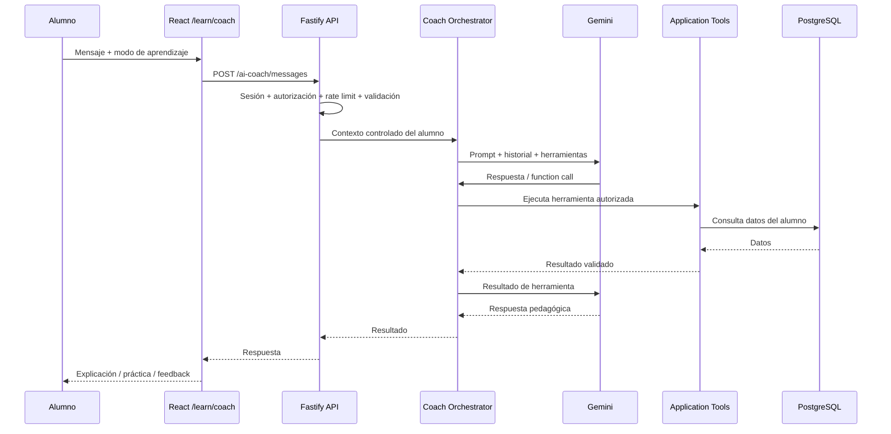
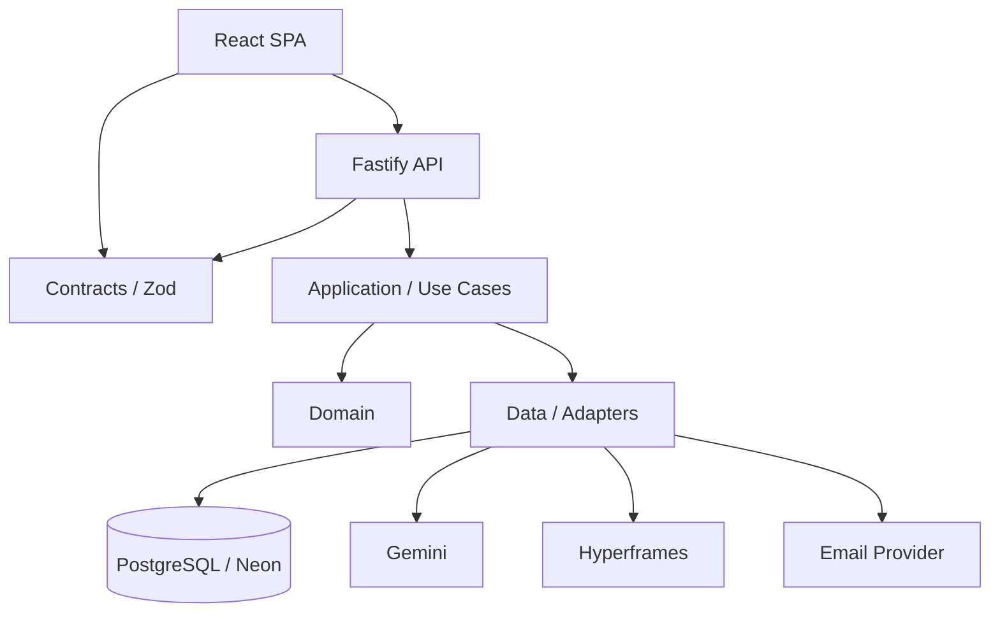

# TFM-BIC — VerbySia

### Plataforma web para aprender idiomas con vídeo pedagógico, audio generado con IA, gamificación y un AI Learning Coach

[](#)
[](#)
[](#)
[](#)
[](#)
[](#)
[](#)
[](#)
[](#)
[](#)
[](#)
[](#)
[](#)

**Demo:** https://www.verbysia.com

**Repositorio (PÚBLICO):** (https://github.com/pvsegura/TFM-BIC/tree/main)

**Autor:** Pascual Vila
**Máster:** Máster en Desarrollo de Software con IA (BIC)  
**Periodo:** 15/09/2026 → 11/10/2026

---

## Índice

- [1. Descripción](#1-descripción)
- [2. Problema y solución](#2-problema-y-solución)
- [3. Funcionalidades](#3-funcionalidades)
- [4. AI Learning Coach](#4-ai-learning-coach)
- [5. Demo](#5-demo)
- [6. Stack tecnológico](#6-stack-tecnológico)
- [7. Arquitectura](#7-arquitectura)
- [8. Contenido disponible](#8-contenido-disponible)
- [9. Uso de IA](#9-uso-de-ia)
- [10. Calidad y testing](#10-calidad-y-testing)
- [11. Seguridad y privacidad](#11-seguridad-y-privacidad)
- [12. Instalación y ejecución local](#12-instalación-y-ejecución-local)
- [13. Scripts](#13-scripts)
- [14. Despliegue](#14-despliegue)
- [15. Documentación](#15-documentación)
- [16. Limitaciones y trabajo futuro](#16-limitaciones-y-trabajo-futuro)
- [17. Entrega académica](#17-entrega-académica)
- [18. Licencia y autor](#18-licencia-y-autor)

---

## 1. Descripción

**VerbySia / TFM-BIC** es una aplicación web para aprender idiomas mediante una combinación de:

- vídeos pedagógicos generados con IA;
- audio de pronunciación generado con Gemini TTS;
- lecciones y ejercicios interactivos;
- vocabulario y fonética;
- progreso y gamificación;
- panel para alumnos y panel para profesores;
- un **AI Learning Coach** que utiliza Gemini como agente conversacional y consulta datos reales del alumno mediante herramientas controladas.

El proyecto se desarrolló como Trabajo de Fin de Máster del **Máster en Desarrollo de Software con IA (BIC)**.

El diseño busca que la IA no sea solamente un elemento decorativo: los vídeos, el audio y el coach forman parte de la experiencia de aprendizaje.

---

## 2. Problema y solución

### Problema

El aprendizaje de idiomas puede fragmentarse entre vídeos, ejercicios, diccionarios y herramientas de conversación sin una conexión clara entre el contenido, la práctica y el progreso individual.

### Solución

VerbySia integra en una única plataforma:

**CONTEXTO → VÍDEO → COMPRENSIÓN → PRÁCTICA → RECUPERACIÓN → PROGRESO**

El contenido se organiza por idioma y nivel MCER/CEFR, mientras que el backend mantiene las reglas de negocio y el estado del alumno.

---

## 3. Funcionalidades

### Alumno

- Registro, inicio/cierre de sesión y recuperación de contraseña.
- Verificación de email.
- Perfil, preferencias y avatar.
- Lecciones y progreso.
- Vídeos pedagógicos y subtítulos/transcripciones cuando están disponibles.
- Vocabulario.
- Fonética e IPA.
- Ejercicios interactivos corregidos en servidor.
- Puntos, logros y progreso.
- AI Learning Coach.
- Gestión de cuenta y privacidad.

### Profesor

- Dashboard específico para profesores.
- Listado de alumnos.
- Seguimiento de progreso.
- Evolución y actividad de aprendizaje.
- Rendimiento en ejercicios.
- Actividad relacionada con lecciones.

El acceso está protegido por rol y autorización en backend.

### Público

- Homepage pública con narrativa visual y scroll.
- Presentación del producto.
- Información sobre el enfoque de aprendizaje.
- Acceso a registro/login.
- Páginas legales y de privacidad.

---

## 4. AI Learning Coach

El **AI Learning Coach** es la funcionalidad de IA interactiva principal del proyecto.

El alumno puede acceder desde `/learn/coach` y desde puntos contextuales de la aplicación.

El flujo conceptual es:



### Características

- Gemini como proveedor de IA.
- Function calling/tool calling.
- **16 herramientas** sobre los casos de uso existentes.
- **7 modos** de interacción.
- Nivel MCER deducido a partir del progreso real.
- El agente no accede directamente a PostgreSQL.
- Las herramientas pasan por la capa de aplicación y sus controles de autorización.
- No permite acciones destructivas arbitrarias.
- El contexto enviado a Gemini se limita a los datos necesarios.
- Evaluación real del comportamiento: **14/15 pruebas PASS**.

La implementación se verificó contra la API real de Gemini antes de cerrar el hito M23.

> Nota: el coach actualmente es **textual**. La viabilidad de Gemini Live API para voz fue verificada, pero la voz conversacional no está implementada todavía.

---

## 5. Demo

### Aplicación desplegada

**https://www.verbysia.com**

Infraestructura actual:

- Render Free para el servicio web.
- Neon Free para PostgreSQL.
- Dominio `verbysia.com` comprado en Namecheap.
- Entorno publicado identificado como `staging` en la documentación de proyecto.

### Credenciales de demostración

No se incluyen credenciales reales en este README.

Para la entrega académica deben crearse cuentas de demostración sin datos personales reales y completar:

| Rol      | Email        | Contraseña   |
| -------- | ------------ | ------------ |
| Profesor | `[RELLENAR]` | `[RELLENAR]` |
| Alumno   | `[RELLENAR]` | `[RELLENAR]` |

Antes de la entrega final debe comprobarse que la cuenta de profesor existe en la base de datos de la demo y que el alumno tiene actividad suficiente para que el dashboard muestre datos.

---

## 6. Stack tecnológico

| Área                       | Tecnología                                        |
| -------------------------- | ------------------------------------------------- |
| Frontend                   | React 19 + TypeScript + Vite                      |
| UI                         | Tailwind CSS + componentes reutilizables          |
| Routing                    | React Router                                      |
| Estado servidor            | TanStack Query                                    |
| Estado cliente             | Zustand, donde está justificado                   |
| Formularios                | React Hook Form + Zod                             |
| Backend                    | Node.js 24 + Fastify 5 + TypeScript               |
| Arquitectura               | Monolito modular + Clean Architecture + Hexagonal |
| Base de datos              | PostgreSQL                                        |
| ORM/adaptadores            | Drizzle                                           |
| Contratos                  | Zod compartido                                    |
| Testing                    | Vitest + React Testing Library                    |
| E2E                        | Playwright                                        |
| Calidad                    | ESLint + Prettier + Husky/lint-staged             |
| CI/CD                      | Jenkins + SonarQube                               |
| Seguridad CI               | gitleaks + auditoría de dependencias              |
| Contenedores               | Docker                                            |
| Hosting                    | Render Free                                       |
| PostgreSQL gestionado      | Neon Free                                         |
| Vídeo                      | Hyperframes + FFmpeg                              |
| Audio                      | Gemini TTS                                        |
| AI Coach                   | Gemini + function calling                         |
| Desarrollo asistido por IA | Claude Code, Gemini y ChatGPT                     |

---

## 7. Arquitectura

El sistema utiliza un **monolito modular**, evitando microservicios, Kubernetes, CQRS o event sourcing salvo que una ADR futura justificase explícitamente una excepción.

### Capas



### Monorepo

```text
apps/
  web/                 React SPA
  api/                 Fastify API

packages/
  domain/              entidades y reglas de negocio
  application/         casos de uso y puertos
  data/                adaptadores y persistencia
  contracts/           DTOs y esquemas Zod
  config/              configuración y variables de entorno
  ui/                  componentes reutilizables
  shared/
  testing/

content/
  languages/
    pl/
    en/
  media/

tests/
  e2e/

infrastructure/
  docker/
  jenkins/
  deployment/

docs/
  adr/
  arquitectura/
  seguridad/
  privacidad/
  producción/
  runbooks/
```

Una regla arquitectónica importante es que el dominio no depende de infraestructura, React ni SDKs externos.

---

## 8. Contenido disponible

Situación documentada a 07/10/2026:

- **Polaco:** A1–C2.
- **Inglés para hispanohablantes:** A1.
- **41 temas de gramática** consultables en total entre polaco e inglés.
- Vídeos pedagógicos generados y versionados.
- Audio de vocabulario y pronunciación.
- Contenido preparado para crecer por idioma y nivel sin modificar la lógica central.

La estructura de contenido separa los datos lingüísticos del código de aplicación.

---

## 9. Uso de IA

La IA se utiliza en tres niveles.

### 9.1 IA como herramienta de desarrollo

Claude Code se utilizó como agente de desarrollo para código, tests, arquitectura y documentación. Gemini y ChatGPT también se utilizaron durante el proceso.

El proyecto mantiene una regla explícita contra la invención de APIs, versiones, precios o requisitos legales. Lo no verificable se marca como `UNKNOWN` o `PENDING`.

### 9.2 IA para generación de contenido

**Audio**

- Gemini TTS.
- Una voz por personaje cuando corresponde.
- Generación mediante herramientas/CLI de operador.
- Reutilización de assets cuando es posible.

**Vídeo**

```text
Guion pedagógico
      ↓
Escenas y personajes
      ↓
Hyperframes
      ↓
MP4
      ↓
FFmpeg / subtítulos / transcripción
      ↓
Asset servido por la aplicación
```

La generación se realiza con límites de llamadas y respeto de la cuota disponible.

### 9.3 IA interactiva

El AI Learning Coach de M23 es el primer flujo en el que el alumno dispara directamente la IA.

El agente consulta información del alumno mediante herramientas controladas y adapta la interacción a su nivel y progreso.

---

## 10. Calidad y testing

Cifras documentadas del proyecto:

- **~4.200 tests** unitarios/componente/aplicación/dominio.
- **~156 tests E2E** con Playwright.
- **~94,6 % de cobertura**.
- Jenkins con pipeline declarativo.
- SonarQube con Quality Gate.
- ESLint + Prettier.
- Husky + lint-staged.
- Auditoría de dependencias.
- Detección de secretos con gitleaks.

La metodología general siguió:

```text
Auditoría
   ↓
Decisiones / ADR
   ↓
RED
   ↓
GREEN
   ↓
REFACTOR
   ↓
Lint + Typecheck + Tests + Coverage
   ↓
E2E + Build + Quality Gate
   ↓
Documentación + despliegue
```

Los hitos posteriores específicamente orientados a contenido audiovisual y al AI Coach mantuvieron la infraestructura existente, pero no añadieron TDD/Playwright/Jenkins/SonarQube/Docker como requisito de implementación del propio hito.

---

## 11. Seguridad y privacidad

El proyecto incorpora, entre otros:

- autenticación y autorización;
- validación de entrada con Zod;
- protección frente a IDOR;
- autorización en backend;
- hashing seguro de contraseñas;
- protección de sesión;
- rate limiting;
- controles CORS/origen cuando aplican;
- cabeceras de seguridad y CSP;
- gestión de secretos mediante variables de entorno;
- no almacenar secretos en Git;
- logs estructurados con redacción de información sensible;
- separación entre logs operativos y datos de aplicación;
- control de acceso a datos del alumno para el AI Coach;
- Gemini sin acceso directo a la base de datos;
- minimización de datos enviados a proveedores de IA.

El proyecto está diseñado con enfoque GDPR/RGPD, pero **no se afirma cumplimiento legal definitivo**: los textos legales y determinados aspectos de tratamiento de datos deben revisarse antes de considerar el producto final jurídicamente cerrado.

---

## 12. Instalación y ejecución local

### Requisitos

- Node.js 24.
- pnpm.
- PostgreSQL, o PostgreSQL mediante Docker para desarrollo.
- Variables de entorno configuradas a partir de `.env.example`.

### Instalación

```bash
corepack enable
pnpm install
```

### Desarrollo

```bash
pnpm dev
```

Por defecto:

- Web: `http://localhost:5173`
- API: `http://localhost:3000`

### Base de datos

```bash
pnpm db:migrate
```

Requiere `DATABASE_URL`.

### Validación de contenido

```bash
pnpm content:validate
```

### Tests

```bash
pnpm test
pnpm test:coverage
pnpm test:e2e
```

### Comprobación completa

```bash
pnpm check
```

> Nunca debe subirse un `.env` real al repositorio. Utilizar `.env.example` como referencia.

---

## 13. Scripts

Los scripts pueden variar ligeramente según el estado de la rama. Los principales documentados son:

| Comando                 | Objetivo                                   |
| ----------------------- | ------------------------------------------ |
| `pnpm dev`              | Ejecutar frontend + API                    |
| `pnpm test`             | Suite Vitest                               |
| `pnpm test:coverage`    | Tests + cobertura                          |
| `pnpm test:e2e`         | Tests Playwright                           |
| `pnpm check`            | Lint + formato + typecheck + tests + build |
| `pnpm db:migrate`       | Aplicar migraciones                        |
| `pnpm content:validate` | Validar contenido                          |

---

## 14. Despliegue

La demo se encuentra desplegada en:

**https://www.verbysia.com**

Arquitectura de despliegue:

```text
Internet
   ↓
Render Free
   ├── React SPA
   └── Fastify API
          ↓
       Neon Free
       PostgreSQL
```

La imagen de producción se construye con Docker y el servicio API sirve también el SPA.

La infraestructura fue elegida buscando coste mínimo y mantenimiento reducido, evitando AWS y servicios que no encajaban con las restricciones del proyecto.

### CI/CD

Jenkins ejecuta validaciones como:

- instalación/validación;
- lint;
- formato;
- typecheck;
- tests;
- cobertura;
- build;
- E2E;
- SonarQube;
- Quality Gate.

---

## 15. Documentación

El repositorio contiene documentación técnica adicional, incluyendo:

- arquitectura;
- ADRs;
- seguridad;
- privacidad;
- producción;
- observabilidad;
- runbooks;
- contexto para agentes de IA;
- documentación específica de los hitos.

Se han registrado **34 ADRs** para decisiones arquitectónicas relevantes.

---

## 16. Limitaciones y trabajo futuro

La situación documentada a 10/10/2026 incluye:

- El adaptador real de email basado en Resend está programado, pero debe confirmarse su activación efectiva en Render y la llegada real de los emails de verificación.
- Render Free puede presentar una primera carga lenta debido al _sleep_ del servicio.
- Los textos RGPD, los términos de Gemini para menores de 18 años y la identificación del responsable del tratamiento requieren revisión legal.
- El contenido polaco debe pasar una revisión final por hablante nativo.
- Parte de los medios de polaco B2–C2 queda pendiente por las cuotas de generación.
- Inglés disponible actualmente en A1.
- El AI Coach es actualmente textual; la conversación por voz con Gemini Live API queda para una fase posterior.
- Hay tests E2E desactualizados tras ampliar el contenido a todos los niveles de polaco y deben actualizarse.
- Futuro: más idiomas, repetición espaciada, rankings, aplicación móvil, CMS, administración y gestión de clases por el profesor.

---

## 17. Entrega académica

### Repositorio GitHub

`https://github.com/pvsegura/TFM-BIC`

### Demo

https://www.verbysia.com

### Presentación

`https://docs.google.com/presentation/d/e/2PACX-1vTh5qddneUXrR8eCNKTvdNta4vqPFM4VZMYnfdkJltTIQTvwok2d_pH74pUAlpXxcFDxZwTNOmw3sc1/pub?start=false&loop=false&delayms=3000`

Archivo incluido en la entrega:

`TFM-BIC-Presentacion-Defensa.pptx`

### Vídeo de defensa

`[RELLENAR — URL pública de YouTube / Drive / plataforma elegida]`

El vídeo debe mostrar:

- explicación propia del proyecto;
- captura de pantalla durante la explicación;
- funcionamiento de la aplicación;
- recorrido por las funcionalidades principales;
- demo del AI Learning Coach;
- arquitectura y decisiones técnicas relevantes.

La aparición de la cara/cámara es opcional.

---

## 18. Licencia y autor

**Licencia:** `MIT License` / proyecto académico privado.

**Autor:** `Pascual Vila`

**GitHub:** `https://github.com/pvsegura/TFM-BIC`

**Demo:** https://www.verbysia.com

---

> **Nota de entrega:** los campos `[RELLENAR]` se han dejado deliberadamente sin completar para no inventar datos. Antes de entregar el TFM deben sustituirse por los datos reales del autor, repositorio, cuentas de demostración y enlaces de presentación/vídeo.
